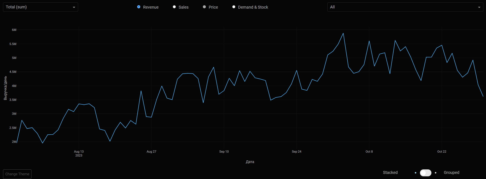
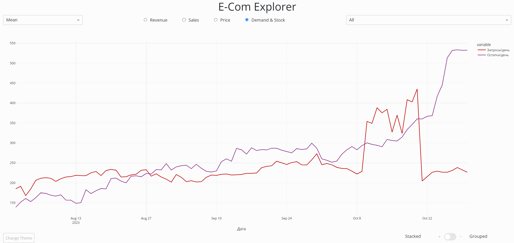
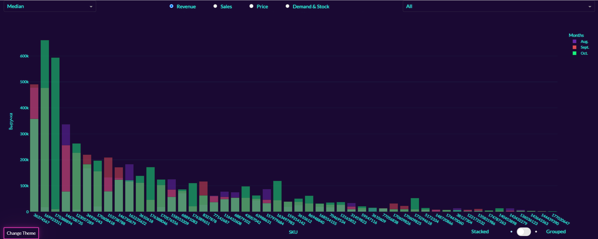
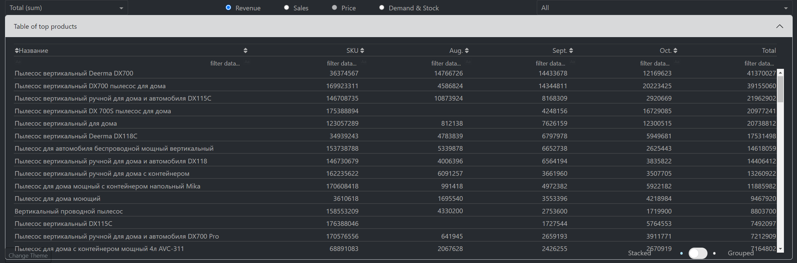
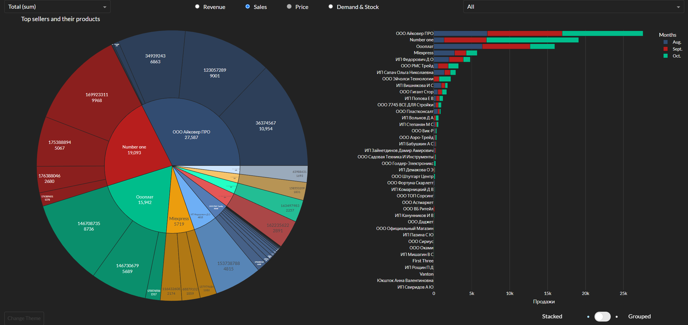
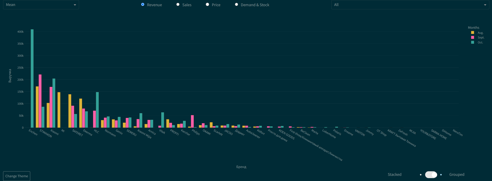

# E-Com Explorer – Unveil Marketplace Dynamics with Precision

    

    
Expand Gallery

    
    
    
    
    

Welcome to E-Com Explorer, the ultimate analytical tool designed to redefine how you analyze marketplace data.

E-Com Explorer was created to solve common challenges faced by businesses in monitoring and optimizing their online marketplace presence. By consolidating critical sales and stock data into one user-friendly platform, it enhances product performance tracking, simplifies the complexity of data analysis with intuitive visualizations, and supports strategic decision-making with interactive charts and metrics.

Unlock the full potential of marketplace analytics with E-Com Explorer, a go-to dashboard for insightful data visualization and performance tracking of products across major online marketplaces such as Wildberries, Ozon, and Yandex.Market. Powered by data from MPSTATS, E-Com Explorer transforms complex sales data into an advanced visual representation with customizable metrics, aiding in strategic decision-making for sellers, marketers, and brand managers. It's not just about numbers; it's about gaining a strategic edge with data-driven decisions.

## Key Features:

- Multi-Dimensional Analysis: Explore the dynamics of specific metrics like revenue, sales, price, requests, and stock levels, either as individual product details or in a comprehensive aggregated view.
- Customizable Aggregation: Tailor your analysis with aggregation options such as the sum, mean, and median, directly influencing how data is consolidated and interpreted.
- Product-wise Analytics: Analyze performance on a per-product basis, including SKU details, monthly aggregates, and overall totals within an intuitive, collapsible table format.
- Enhanced Data Interaction: Utilize advanced interactive and dynamic visualizations, including line charts for daily sales trends, sunburst charts for seller performance and their items, and bar charts for comprehensive brand analysis, allowing for in-depth comparisons and insights.
- Custom Theming and Chart Types: Personalize your dashboard experience with 15 selectable themes and toggle between stacked or grouped visual representations to best suit your data presentation needs.

E-Com Explorer Dashboard is not only a powerhouse of information but also a pleasure to interact with. Every aspect, from selecting metrics to collapsing tables, has been designed with user experience in mind.

Utilizing a robust stack that includes pandas, numpy, plotly, and dash, E-Com Explorer Dashboard ensures a seamless and responsive user experience. Every chart and metric updates dynamically with given input, providing interactive insights that are both accurate and actionable.

E-Com Explorer stands as a testament to cutting-edge web app development for data-driven insights. Enjoy a responsive and intuitive interface that makes data analysis not only insightful but enjoyable.

## Get Started

Start exploring the endless possibilities and gain the competitive edge you need in the bustling e-commerce landscape.

### Installation and Usage (Linux, bash)

Clone the repository:

    git clone https://github.com/mayushii21/e-com-explorer

Navigate to the folder:

    cd e-com-explorer

Create a python virtual environment:

    python -m venv ecom

Activate the virtual environment:

    source ecom/bin/activate

Install the package from the current folder:

    pip install .

Execute the following command and open localhost with port 8050:

    ecomxplor

Embrace the power of data with E-Com Explorer and chart your path to marketplace success with clarity and confidence. Whether you're scaling your product line, assessing competitive dynamics, or refining your pricing strategy, a game-changing dashboard is an essential tool for marketplace mastery.

## Contact

Telegram: [@mayushii21](https://t.me/mayushii21)  
Email: <the.real.mayushii21@gmail.com>
